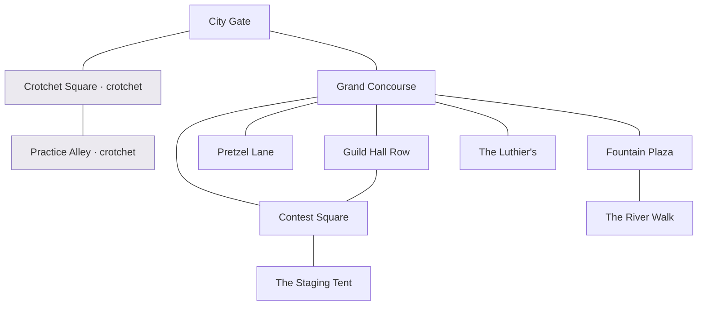

# Location Design — The City of Concerta (Zone 3, room navigation)

The second location mapped for the Space Quest–style RoomView, after the Academy.
Same model (see `docs/ROOMVIEW_BUILD_SPEC.md` and
`docs/LOCATION_DESIGN_HARMONIA.md`): discrete **rooms**, each a static scene with
a description, exits, present NPCs, and hotspots; click between rooms.

**Zone 3 — The City of Concerta** is the class's first field trip beyond the
Academy: a bright metropolis dressed for the **Concerta Invitational**, a
single-elimination inter-school contest. It reuses the existing Zone-3 content
already in `src/lib/world/content.ts` (`ZONE3`) — the six required challenges, the
semifinal/final bracket — plus the Zone-3 side-quests and classmate recruits.

> No user floor plan yet (the Academy had one). This is a first draft — happy to
> redraw against a Concerta map if you sketch one, exactly like we did for the
> Academy.

## Decisions carried over
- **D1 (locations):** Concerta already has two real `locations.ts` ids —
  **`concerta`** and **`crotchet`**. No new `GameLocation`s: every city room →
  `concerta`; every Crotchet room → `crotchet`. All rooms `zoneId: 3`.
- **D2 (one place):** Concerta + its practice-town Crotchet render as **one
  navigable map**; movement ungated. Content gates by progress via the existing
  `unlock` predicates: the **Invitational bracket** stays locked until all six
  required challenges are done (`allRequiredDone`), the **final** until the
  semifinal is won (`z3_semifinal_won`), exactly as `ZONE3` already defines.

## Room graph

## Rooms

**Maps to** = existing `locations.ts` id · all `zoneId: 3`.

### Arrival & Crotchet (the practice town — required drills)
| Room | Maps to | Who's here | Scene & hotspots / hooks |
|---|---|---|---|
| **City Gate** | `concerta` | — | You arrive from the Academy road; Concerta glows in the valley, banners strung rooftop to rooftop for the Invitational. Look at the city; look back at the road. Entry room. |
| **Crotchet Square** | `crotchet` | — | The quiet practice-town on the way in, where every visiting school warms up. Drills: **z3_eb_scale** (E♭ scale), **z3_dotted_quarter** (rhythm), **z3_aural_intervals**. |
| **Practice Alley** | `crotchet` | — | Reeds soaking, scales climbing the alley walls. Drills: **z3_two_octave_scale** (two-octave B♭), **z3_aural_two_bar** (rhythm echo), **z3_cresc_decresc_long** (optional dynamics). |

### The Festival City
| Room | Maps to | Who's here | Scene & hotspots / hooks |
|---|---|---|---|
| **Grand Concourse** | `concerta` | crowds | The main avenue, packed and loud, every guild flying its colors. Hub. **Read the Invitational bracket** (contest notice → foreshadows the matchups); look at the crowd. |
| **Fountain Plaza** | `concerta` | **Bellamy** | A grand fountain ringed with buskers. Talk Bellamy → **Street Harmony** (`sq_z3_busker`, aural melody-mapper). Toss a coin. |
| **Pretzel Lane** | `concerta` | **Coda** | A side lane of festival food carts. Talk Coda → **Fanfare for the Pretzel Cart** (`sq_z3_vendor_fanfare`). **Take a warm pretzel** (item). |
| **Guild Hall Row** | `concerta` | **Tommy**, rival students | The three rival schools' halls — **Choral College**, **Piano Preparatory**, **The String School** — banners and trash-talk. Talk Tommy → classmate recruit (`recruitProgress 3`); size up the rivals (foreshadows the bracket). |
| **The Luthier's** | `concerta` | shopkeeper | A cramped shop of strings, reeds and valve oil. **Browse gear** → routes to `/shop`; get a quick repair (small heal/flavor). |
| **The River Walk** | `concerta` | — | The Cadence River slides through the city; a quiet beat away from the crowds. Sit and breathe; look at the water (calm before the contest). |

### The Contest
| Room | Maps to | Who's here | Scene & hotspots / hooks |
|---|---|---|---|
| **Contest Square** | `concerta` | Valeria (pre-match), Miles & Gene (post-win), **Gene cameo** | The Invitational stage in the packed square. **z3_accent** (required, performed on the stage). **The Concerta Invitational** bracket: **Semifinal** vs Piano Preparatory (`z3_semifinal` → `z3_semifinal_won`, non-advancing win gate) then **Final** vs The String School (`z3_final` → `z3_contest_won`, advances to Zone 4). Miles & Gene recruit on `z3_contest_won`; Gene's "In Passing" cameo (`gene_contest`). |
| **The Staging Tent** | `concerta` | **Valeria Croft**, **Benny** (post-semifinal) | Backstage: warm-up stands, nerves, the Academy's colors. Talk Valeria → story ("Nervous? Good. Channel it."). Benny recruits here after the semifinal (`z3_semifinal_won`). |

## Content-hook summary (all already in `content.ts` / `sidequests.ts` / `students.ts`)
- **Required (6):** `z3_eb_scale`, `z3_dotted_quarter`, `z3_aural_intervals`
  (Crotchet Square); `z3_two_octave_scale`, `z3_aural_two_bar` (Practice Alley);
  `z3_accent` (Contest Square). Optional `z3_cresc_decresc_long` (Practice Alley).
- **Bracket gates:** semifinal (`z3_semifinal` → `z3_semifinal_won`, non-advancing;
  unlock `allRequiredDone`) and final (`z3_final` → `z3_contest_won`, `advanceTo 4`;
  unlock `z3_semifinal_won`) — both in Contest Square, exactly as `ZONE3` defines.
- **Side-quests:** `sq_z3_busker` (Bellamy, Fountain Plaza), `sq_z3_vendor_fanfare`
  (Coda, Pretzel Lane).
- **Classmates:** Tommy (Guild Hall Row, `recruitProgress 3`), Benny (Staging Tent,
  `z3_semifinal_won`), Miles + Gene (Contest Square, `z3_contest_won`). Cameo
  `gene_contest` (Contest Square, `progress 3`).
- **Story:** Valeria Croft (Staging Tent / Contest Square).

## Inventory (light)
- **Warm pretzel** — pickup at Pretzel Lane (flavor; a callback to the Academy's).
- **Prize ribbon** — awarded on `z3_contest_won` (flavor; the Academy's colors).

Keep it lighter than the Academy — Concerta's draw is the contest and the crowd,
not item puzzles.

## Minimap coordinates (x,y 0–100, for RoomView)
`city_gate (50,92)` · `crotchet_square (20,78)` · `practice_alley (12,62)` ·
`grand_concourse (55,68)` · `pretzel_lane (80,74)` · `fountain_plaza (82,55)` ·
`guild_hall_row (32,52)` · `luthiers_shop (80,40)` · `contest_square (52,40)` ·
`staging_tent (52,24)` · `river_walk (90,64)`.

## Build order (after the Academy RoomView proves out)
Concerta drops into the same `rooms.ts` + `RoomView`: add these 11 rooms + edges
(all `zoneId 3`, `locationId` `concerta`/`crotchet`), wire the hooks to the
existing `ZONE3` challenges/bracket and the Zone-3 quests/recruits, and it renders
through the same component. No engine changes. An interactive click-through
prototype (like the Academy's) can be spun up on request for review/refinement.
