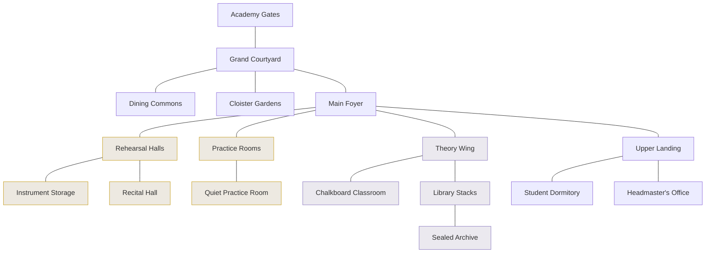

# Location Design — Harmonia Academy (room navigation)

A **Space Quest–style** room map for the Academy: the player clicks between
discrete **rooms**, each a static illustrated scene with a short description,
a few **exits** to adjacent rooms, and **hotspots** to look at / talk to / do.
No animation — just click through rooms and choose prompts.

> **Interactive prototype:** the clickable version of this map (navigate room to
> room, see scenes/exits/options) is published as an Artifact. Ask Claude for the
> link, or rebuild from this spec.

This is the first location designed at room granularity. It deliberately builds on
the existing engine rather than replacing it (see **Engine integration** below).

---

## Design model

| Concept | Meaning |
|---|---|
| **Room** | One screen: a scene image, a description (adventure-game second person), exits, and hotspots. The unit of navigation. |
| **Exit** | A directional link to an adjacent room (`N/S/E/W`, `U/D` for stairs, `IN/OUT` for deeper rooms). Bidirectional. |
| **Hotspot** | A `Look / Talk / Listen / Read / Step / Rest …` action that prints a response. Some hotspots are **hooks** into existing systems (a challenge, a side-quest offer, a mini-boss, a story beat). |
| **Cluster** | A group of rooms that rolls up to one existing `location` in `locations.ts` (so encounters/zone logic keep working). |

The Academy is the Act I home base; **Zone 1** (Rehearsal Halls) and **Zone 2**
(Theory Wing) both live inside it. Rooms in the four existing clusters map to
current `locations.ts` ids; the rest are new connective tissue.

## Room graph

## Rooms

Legend for **Maps to**: an existing `locations.ts` id (cluster) or _new_.

### Approach & hub
| Room | Maps to | Exits | Who's here | Key hotspots / hooks |
|---|---|---|---|---|
| **The Academy Gates** | _new_ (entry) | N → Courtyard | — | Look at Concerta below; the treble-clef gates. Entry point / return-to-world. |
| **The Grand Courtyard** | _new_ (hub) | S Gates · N Foyer · W Dining · E Gardens | passing students | **Quest Board** (surfaces Zone 1 side-quests); fountain; statue of The Composer (lore). |
| **The Main Foyer** | _new_ (hub) | S Courtyard · W Rehearsal · E Theory · U Landing · D Practice | — | Portraits of the **ten Maestros** (lore/foreshadow); grand staircase. |
| **The Dining Commons** | _new_ | E Courtyard | classmates | Sign: **Concerta Invitational** (foreshadows Zone 3); classmate chatter. |
| **The Cloister Gardens** | _new_ | W Courtyard | — | Bench (quiet beat); the Renewal tree (quiet foreshadow). |

### Zone 1 cluster — Boot Camp (`rehearsal_halls`, `practice_rooms`)
| Room | Maps to | Exits | Who's here | Key hotspots / hooks |
|---|---|---|---|---|
| **The Rehearsal Halls** | `rehearsal_halls` | E Foyer · W Storage · N Recital | Maestro Barenboimi | Talk Barenboimi (story); **challenge stands** → Zone 1 required challenges. |
| **Instrument Storage** | `rehearsal_halls` | E Rehearsal | — | Loaner racks; workbench (flavor / future gear/repair). |
| **The Recital Hall** | `rehearsal_halls` | S Rehearsal | (Fennelio at graduation) | **Step onto the stage** → Boot Camp graduation gate; Maestros' reserved seats. |
| **The Practice Rooms** | `practice_rooms` | U Foyer · IN Quiet Room | Reeda, Tick | Talk Reeda → **The Squeaky Door**; Talk Tick → **Keeping Time**; the hungry hush (aural challenges live here). |
| **A Quiet Practice Room** | `practice_rooms` | OUT Practice | — | **Face the silence** → the **Rest Wraith** (Zone 1 mini-boss); the rippling reed cup. |

### Zone 2 cluster — Theory (`theory_wing`, `library_stacks`)
| Room | Maps to | Exits | Who's here | Key hotspots / hooks |
|---|---|---|---|---|
| **The Theory Wing** | `theory_wing` | W Foyer · N Classroom · E Library | Maestro Persichetti, Piccola | Talk Persichetti (story); Talk Piccola → **Stage Fright**; the crossed-out old scores. Zone 2 required challenges. |
| **The Chalkboard Classroom** | `theory_wing` | S Theory | — | Chalkboard (“dissonance demands resolution”); carved desks. |
| **The Library Stacks** | `library_stacks` | W Theory · N Archive | Dr. Sol | Talk Dr. Sol → **The Misfiled Interval**; the struck-through **tritone** catalog; **follow the echo** → **Interval Imp** (Zone 2 mini-boss). |
| **The Sealed Archive** | `library_stacks` | S Library | — | Chained cabinet; **the humming score** — a pitch between two notes (foreshadows the Shattering). |

### Upstairs
| Room | Maps to | Exits | Who's here | Key hotspots / hooks |
|---|---|---|---|---|
| **The Upper Landing** | _new_ (hub) | D Foyer · E Dormitory · W Office | — | Window over the courtyard/valley. |
| **The Student Dormitory** | _new_ | W Landing | Piper, Reed | Talk Piper / Talk Reed → **classmate recruitment**; **rest at your bunk** (save/mend). |
| **The Headmaster's Office** | _new_ | E Landing | Director Fennelio | Talk Fennelio (graduation charge / story); the Academy seal. |

---

## Engine integration

The rooms reuse what's already built; nothing about combat/challenges changes.

- **Rooms roll up to `locations.ts`.** Each room carries a `locationId` (its
  cluster). Encounter/zone logic stays location-based, so a room in the
  `practice_rooms` cluster still triggers Zone 1 encounters. New connective rooms
  (courtyard, foyer, dorm, office, archive, gardens, dining) can either get their
  own lightweight `GameLocation` entries (Act 1) or borrow their cluster's id.
- **Scenes reuse existing primitives.** A room's description + hotspots are the
  same shape as the current `ExplorePage` scene panel: blurb, present NPCs
  (`npcsAt`), and activities (`locationActivities`). "Talk" hotspots route to the
  existing `LiberationScene` / quest-offer / recruitment flows; challenge and
  gate hotspots open `ChallengeModal`; mini-boss hotspots open `BattleScreen`.
- **What's genuinely new** is the **room layer**: a `rooms` graph (id, name,
  scene, `exits[]`, `hotspots[]`, `locationId`, map x/y) and a room-based
  `ExploreRoom` view that renders one room's scene + exit buttons instead of the
  top-down node map. Suggested home: `src/lib/world/rooms.ts` (data) + a
  `RoomView` component; keep the current node map as a fallback for
  not-yet-roomed zones behind a flag, exactly like `LOCATION_BASED_ZONES`.
- **Movement/state:** `currentRoom` per character in localStorage (same pattern
  as `currentLocation`), keyed by character + zone; default to the cluster's
  entry room.

## Open questions for the next pass

1. Do connective rooms get their own `GameLocation` entries, or borrow the
   cluster id? (Affects encounter placement in the halls vs. the courtyard.)
2. Should the room view **replace** the top-down node map everywhere, or coexist
   (map for travel between clusters, rooms within a cluster)?
3. Art: one static scene image per room (17 here) — same FF6 pixel-art pipeline
   as the intro. Which rooms are must-have vs. text-only to start?

Once the model is agreed, the natural next step is a `rooms.ts` + `RoomView`
prototype wired to the Academy, then rolling the same treatment out zone by zone.
