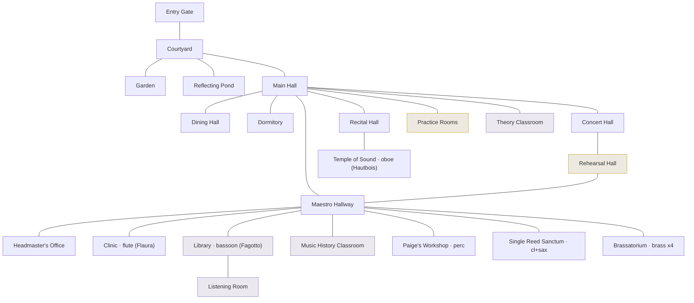

# Location Design — Harmonia Academy (room navigation)

A **Space Quest–style** room map for the Academy: the player clicks between
discrete **rooms**, each a static illustrated scene with a short description,
a few **exits** to adjacent rooms, and **hotspots** to look at / talk to / do.
No animation — just click through rooms and choose prompts.

Built to the uploaded **Harmonia Academy floor plan** (`docs/assets/` reference):
a top-down, T-shaped building — Entry Gate → Courtyard feeding the ground-floor
**Main Hall** hub, with the **Maestro Hallway** as the upper hub.

> **Interactive prototype:** the clickable version of this map (navigate room to
> room, see scenes/exits/options) is published as an Artifact. Ask Claude for the
> link, or rebuild from this spec.

> **Direction (decided):** the room view **replaces the top-down node map in every
> zone.** `ExplorePage`'s node map is retired in favor of a room-based `RoomView`;
> each zone gets decomposed into rooms the way the Academy is here.

---

## Design model

| Concept | Meaning |
|---|---|
| **Room** | One screen: a scene image, a description (adventure-game second person), exits, and hotspots. The unit of navigation. |
| **Exit** | A link to an adjacent room. On a top-down floor plan, direction (N/S/E/W arrow + "Head north …") is derived from the two rooms' positions. Bidirectional. |
| **Hotspot** | A `Look / Talk / Listen / Read / Rest …` action that prints a response. Some hotspots are **hooks** into existing systems (a challenge, a side-quest, a mini-boss, a story beat). |
| **Cluster** | A group of rooms that rolls up to one `location` in `locations.ts`, so encounters/zone logic keep working. |

The Academy is the Act I home base; **Zone 1** (Boot Camp) and **Zone 2** (Theory)
both live inside it. Rooms in those clusters map to current `locations.ts` ids; the
rest are new connective tissue and lore/utility rooms.

## Room graph

The ten Maestros keep **six offices, grouped by instrument family** (the flute
maestro's Clinic and the bassoon maestro's Library double as those rooms; the
Temple of Sound sits off the Recital Hall):

| Office | Maestro(s) | Instrument(s) |
|---|---|---|
| **The Clinic** | Flaura | flute — also the infirmary / heal point |
| **The Library** | Fagotto | bassoon — shared with Dr. Sol, the librarian |
| **Paige's Workshop** | Paige | percussion — drum kit + artificer's bench (foreshadows her Concerta forge) |
| **The Single Reed Sanctum** | Clarence, Adolpha | clarinet, alto sax |
| **The Brassatorium** | Cornelius, Sackbut, Waldhorn, Torbult | trumpet, trombone, French horn, tuba |
| **The Temple of Sound** | Hautbois | oboe — a mystical shrine off the Recital Hall; birthplace of the tuning A |

## Rooms

**Maps to**: an existing `locations.ts` cluster, or _new_.

### Approach & grounds
| Room | Maps to | Who's here | Key hotspots / hooks |
|---|---|---|---|
| **Entry Gate** | _new_ (entry) | — | View of Concerta in the valley; the treble-clef gate. Entry / return-to-world. |
| **Courtyard** | _new_ (hub) | Piper, Cora | Piper & Cora transfixed by the statue of The Composer (recruitable). (Quest Board moved to the Main Hall.) |
| **Garden** | _new_ | Maestro Waldhorn | Waldhorn (horn maestro) walking the path; the bench; the Renewal tree; **pick a flower** (item). |
| **Reflecting Pond** | _new_ | Obie | Obie (oboe student — reflective-but-cheerful; recruitable); the reflection that ripples wrong (foreshadow). |

### Ground floor — the Main Hall & performance rooms
| Room | Maps to | Who's here | Key hotspots / hooks |
|---|---|---|---|
| **Main Hall** | _new_ (hub) | — | **Quest Board** (surfaces Zone 1 side-quests); the Academy banner; the directory; "listen to the Academy". |
| **Rehearsal Hall** | `rehearsal_halls` | Maestro Barenboimi | Talk Barenboimi (story); **challenge stands** → Zone 1 required challenges. |
| **Concert Hall** | _new_ | — | The grand hall (Zone 2 ensemble / Winter Concert); **tune the grand** with the Tuning Fork (item use). |
| **Recital Hall** | `rehearsal_halls` | Sackbut, Torbult | The trombone & tuba maestros' note-holding contest; **step onto the stage** → graduation gate; the **Temple of Sound** opens off it. |
| **Dining Hall** | _new_ | Tommy, Otto | Tommy & Otto forever eating (recruitable); **Concerta Invitational** sign (Zone 3); a warm pretzel (item). |
| **Dormitory** | _new_ | Gene | Gene tinkering with aux instruments to show Paige (recruitable); **rest at your bunk** (save/mend). |

### Study wing (Zone 2) & aural
| Room | Maps to | Who's here | Key hotspots / hooks |
|---|---|---|---|
| **Theory Classroom** | `theory_wing` | Persichetti, Piccola, **Vexus** | Talk Persichetti; Talk Piccola → **Stage Fright** (gift her the flower); **watch Vexus** annotating the ten Renewal scores — "beautiful, but timid" (foreshadow). Zone 2 challenges. |
| **Library** | `library_stacks` | Fagotto, Dr. Sol, Reed | Bassoon maestro's office. Talk Dr. Sol → **The Misfiled Interval**; **tritone** catalog; **follow the echo** → **Interval Imp**; Reed deep in Symphonica's history (recruitable); **borrowing card** (item). |
| **Listening Room** | aural (Zone 1/2) | Zoot | Zoot ("know what's come before"; recruitable); **headphones** → aural challenges; **play the sealed cylinder** (needs the library card). |
| **Music History Classroom** | _new_ | — | Timeline of the Composer & the Renewal; a mural of the Grand Symphony with **"Vexus, Conductor"** (foreshadows Vexus). |

### Zone 1 — practice
| Room | Maps to | Who's here | Key hotspots / hooks |
|---|---|---|---|
| **Practice Rooms** | `practice_rooms` | Reeda, Tick, Benny | Talk Reeda → **The Squeaky Door**; Talk Tick → **Keeping Time**; Benny drilling technique (recruitable); **the room at the end** → the **Rest Wraith** (mini-boss). |

### Upper floor — the Maestro Hallway & offices
The section leaders' six offices open off the Maestro Hallway (Clinic and Library
covered above; Temple of Sound is off the Recital Hall).

| Room | Maps to | Who's here | Key hotspots / hooks |
|---|---|---|---|
| **Maestro Hallway** | _new_ (hub) | — | Portraits of the ten Maestros; the six family offices open off it; the Renewal notice (lore/foreshadow). |
| **Clinic** | _new_ | Maestra Flaura (flute) | Flute maestro's studio + infirmary. **Rest and mend** (restore HP); Flaura's worry about students “grey around the edges” (quiet foreshadow). |
| **Paige's Workshop** | _new_ | Maestra Paige (perc) | Concert percussion — timpani, snare, auxiliary station, xylophone — + artificer's bench. Talk Paige (foreshadows her Concerta forge). |
| **The Single Reed Sanctum** | _new_ | Clarence, Adolpha | Clarence shaving reeds & throwing them like stars; Adolpha ripping dom-7 arpeggios & modal scales in every key at absurd tempo. |
| **The Brassatorium** | _new_ | Cornelius | Only Cornelius is home, composing brass-ensemble music (Waldhorn's in the garden; Sackbut & Torbult in the recital hall). |
| **Headmaster's Office** | _new_ | Director Fennelio | Talk Fennelio (graduation charge); **ask about the Grand Symphony** → he's the founding Conductor who passed the baton to Vexus; his ever-unfinished ensemble treatise. |

### Off the Recital Hall
| Room | Maps to | Who's here | Key hotspots / hooks |
|---|---|---|---|
| **The Temple of Sound** | _new_ | Maestro Hautbois (oboe) | A mystical shrine to music. Talk Hautbois; **sound the sacred A** (the tuning pitch the whole Academy bows to). |

---

## New canon introduced here (fold into NARRATIVE.md)

Two story beats added while casting the Academy — worth reconciling with `NARRATIVE.md`:

- **Fennelio is the founding Conductor of the Grand Symphony.** He led the very
  first Renewals, then passed his baton to **Vexus** and founded Harmonia Academy
  to train the Maestros. (Deepens the betrayal — Vexus inherited the podium.)
- **Vexus is present at the Academy before the Shattering**, in the Theory
  Classroom, already annotating the ten original Renewal scores and finding them
  "beautiful, but timid" — the seed of his rewrite, in plain sight.

## Adventure-game layer (prototype)

A light **inventory** demonstrates Space Quest–style item logic — pick something
up in one room, use it in another. Prototyped in the interactive map; a real build
would persist `carrying` per character alongside `currentRoom`.

| Item | Found in | Used in | Effect |
|---|---|---|---|
| **Tuning Fork** | Temple of Sound | Concert Hall | Tune the concert grand (a "use" gated on carrying the fork). |
| **Library Card** | Library | Listening Room | Unlock the sealed ARCHIVE cylinder. |
| **Pressed Flower** | Garden | Theory Classroom | Give to Piccola — eases her stage fright (consumed on give). |
| **Warm Pretzel** | Dining Hall | — | Flavor pickup. |

Pattern: a room may declare `pickups` (a "Take …" action that adds an item and
then disappears) and `uses` (an action gated on carrying an item; shows a helpful
"you'd need X" hint when you don't, and can consume the item — e.g. a gift). This
is the same hotspot mechanism, just item-aware.

## Engine integration

The rooms reuse what's already built; nothing about combat/challenges changes.

- **Rooms roll up to `locations.ts`.** Each room carries a `locationId` (its
  cluster). Encounter/zone logic stays location-based, so a room in the
  `practice_rooms` cluster still triggers Zone 1 encounters. New connective/lore
  rooms either get a lightweight `GameLocation` entry (Act 1) or borrow a nearby
  cluster's id — see open question 1.
- **Scenes reuse existing primitives.** A room's description + hotspots are the
  same shape as the current `ExplorePage` scene panel: blurb, present NPCs
  (`npcsAt`), and activities (`locationActivities`). "Talk" hotspots route to the
  existing `LiberationScene` / quest-offer / recruitment flows; challenge and
  gate hotspots open `ChallengeModal`; mini-boss hotspots open `BattleScreen`.
- **The new room layer (replaces the node map).** A `rooms` graph
  (id, name, scene, `locationId`, `edges[]`, map x/y) plus a `RoomView` that
  renders one room's scene + derived directional exits. `RoomView` **replaces**
  the top-down node map in `ExplorePage` for every zone. Suggested home:
  `src/lib/world/rooms.ts` (data) + a `RoomView` component. Roll it out per-zone
  behind the existing `LOCATION_BASED_ZONES`-style flag so unconverted zones stay
  playable during the migration.
- **Movement/state:** `currentRoom` per character in localStorage (same pattern
  as `currentLocation`), keyed by character + zone; default to the cluster's
  entry room (Entry Gate for the Academy).

## Open questions for the next pass

1. Do connective/lore rooms (Main Hall, Courtyard, Maestro Hallway, Clinic…) get
   their own `GameLocation` entries, or borrow a cluster id? (Affects where
   encounters can fire — a corridor vs. a rehearsal hall.)
2. Art: one static scene image per room (22 here) via the same FF6 pixel-art
   pipeline as the intro. Which rooms are must-have vs. text-only to start?
3. Zone boundaries inside one building: Boot Camp (Zone 1) and Theory (Zone 2)
   share the Academy — does moving between their rooms advance the "zone," or is
   the Academy one continuous space with challenges gated by progress?

Next step once the model is agreed: a `rooms.ts` + `RoomView` prototype wired to
the Academy (replacing the node map here first), then the same treatment zone by
zone.
